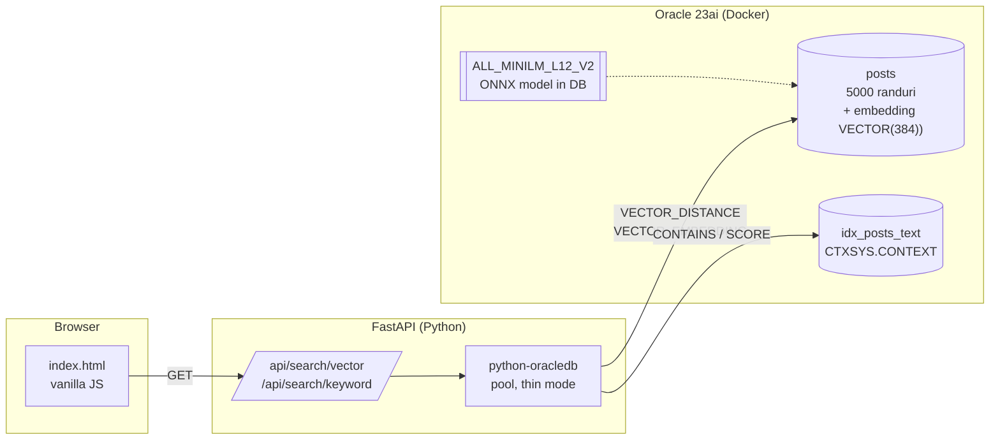

# Oracle Vector Search vs Keyword Search — Demo

> **Tema 10** — *Topici Speciale in Baze de Date si Tehnologii Web*
> Universitatea din Bucuresti, Facultatea de Matematica si Informatica
>
> Studenti:
> Ciprian Amza (506)
> Nicolae Marius Gherghu (507)

Demo functional end-to-end care compara **cautarea semantica (vectoriala)** cu
**cautarea lexicala (keyword) clasica** pe acelasi corpus de date, folosind
Oracle Database 23ai.


*(screenshot dupa primul rulaj — vezi `docs/screenshots/`)*

---

## 1. Tema si obiectiv

Cautarea informatiei in volume mari de text a fost dominata zeci de ani de
**indexare lexicala** (TF-IDF, BM25, indexi inversi). Aceste tehnici se
bazeaza pe potrivire de cuvinte si nu inteleg semantica: "*how to make my code
faster*" si "*how to optimize performance*" sunt, pentru un index lexical,
documente complet diferite.

Aparitia modelelor de tip *transformer* (BERT, MiniLM, etc.) a permis
reprezentarea documentelor ca **embeddings** — vectori densi in spatii de
sute de dimensiuni — unde proximitatea geometrica corespunde apropierii
semantice. Cautarea devine atunci o problema de *nearest neighbor search*
intr-un spatiu vectorial.

Oracle Database 23ai introduce suport nativ pentru aceste embeddings prin:

- tipul de date `VECTOR(N, FLOAT32)`
- functia `VECTOR_DISTANCE(...)` cu metrici COSINE / DOT / EUCLIDEAN
- procedura `DBMS_VECTOR.LOAD_ONNX_MODEL` care permite incarcarea unui model
  de embedding **direct in baza de date**
- functia SQL `VECTOR_EMBEDDING(model USING text)` pentru generare in-DB

**Obiectivul demo-ului**: aratam, side-by-side, **acelasi query** rulat prin
ambele tehnici si analizam diferentele:
- *cand castiga* embedding-urile (intrebari conceptuale, parafrazate, in
  limbaj natural)
- *cand castiga* indexul lexical (nume canonice de API-uri, exceptii,
  identificatori)
- *cand sunt comparabile* (queries scurte si comune)

> **Doua moduri de generare a embedding-urilor in Oracle 23ai**:
>
> 1. **In-database** (modul preferat arhitectural): modelul ONNX
>    `all_MiniLM_L12_v2` se incarca via `DBMS_VECTOR.LOAD_ONNX_MODEL` si
>    `VECTOR_EMBEDDING(model USING text)` produce vectorul direct in SQL.
>    Scripturile noastre `sql/03_load_onnx_model.sql` si
>    `sql/04_generate_embeddings.sql` demonstreaza acest mod si pot fi rulate
>    cand modelul este disponibil.
>
> 2. **Client-side** (folosit in implementarea curenta): aceeasi varianta de
>    `all-MiniLM-L12-v2` din `sentence-transformers`/HuggingFace genereaza
>    embedding-urile in proces Python, iar Oracle stocheaza si interogheaza
>    vectorii rezultati prin coloana `VECTOR(384)` si `VECTOR_DISTANCE()`.
>
> **De ce client-side in versiunea livrata?** Modelul augmented al Oracle este
> distribuit printr-un PAR (Pre-Authenticated Request) pe Object Storage care
> *expira periodic*. Pentru un demo livrat la deadline si reproductibil pe
> orice masina la o data viitoare, abordarea client-side garanteaza ca demo-ul
> functioneaza chiar si daca PAR-ul Oracle nu mai e accesibil. Calculele
> vector_distance, ranking si retrieval raman 100% in baza de date Oracle 23ai.

---

## 2. Arhitectura solutiei



Detalii in [`docs/architecture.md`](docs/architecture.md).

**Componente**:

| Strat | Tehnologie | Rol |
|---|---|---|
| Database | Oracle Database 23ai Free (Docker, ARM64) | Storage + cautare vectoriala + Oracle Text |
| Embeddings | `all_MiniLM_L12_v2` ONNX, **in DB** | Generare vectori 384-dim |
| Backend | Python 3.10+, FastAPI, python-oracledb (thin) | API REST, JSON |
| Frontend | HTML/CSS/JS vanilla | UI side-by-side, fara framework |
| Setup | Docker Compose, bash scripts | Reproducere one-shot |

---

## 3. Stack tehnologic — versiuni

| Component | Versiune |
|---|---|
| Oracle Database | **23ai Free** (`container-registry.oracle.com/database/free:latest-lite`) |
| Model embedding | `all_MiniLM_L12_v2` (sentence-transformers, 384 dim, ~125 MB ONNX) |
| Python | 3.10+ |
| FastAPI | 0.115.x |
| python-oracledb | 2.5.x (thin mode — fara Instant Client) |
| HuggingFace `datasets` | 3.1.x |
| Dataset | `pacovaldez/stackoverflow-questions` (sub-set 5000 randuri) |
| Docker | 24+ (Compose v2) |
| Sistem | macOS Apple Silicon (M-series), nativ ARM64 |

Nu se folosesc:
- niciun ORM (raw SQL prin python-oracledb)
- niciun API extern (OpenAI, HuggingFace inference, etc.)
- niciun framework JS (React/Vue/Angular) — doar fetch nativ

---

## 4. Modelul de date

Tabela principala:

```sql
CREATE TABLE posts (
  id        NUMBER PRIMARY KEY,
  title     VARCHAR2(500),
  body      CLOB,
  tags      VARCHAR2(500),
  score     NUMBER,
  embedding VECTOR(384, FLOAT32)
);
```

Indexi:

```sql
-- Datastore care concateneaza title + body intr-un singur document virtual
BEGIN
  CTXSYS.CTX_DDL.CREATE_PREFERENCE('demo_datastore', 'MULTI_COLUMN_DATASTORE');
  CTXSYS.CTX_DDL.SET_ATTRIBUTE('demo_datastore', 'COLUMNS', 'title, body');
END;
/

-- Index Oracle Text peste title + body (baseline keyword)
CREATE INDEX idx_posts_text ON posts(body)
  INDEXTYPE IS CTXSYS.CONTEXT
  PARAMETERS ('DATASTORE demo_datastore LEXER demo_lexer SYNC (ON COMMIT)');
```

> **Comparatie simetrica title + body**: atat embedding-ul vectorial cat si
> indexul Oracle Text acopera `title || ' ' || body`. Sintactic, indexul e
> declarat pe `body`, dar `MULTI_COLUMN_DATASTORE` face Oracle Text sa
> indexeze textul concatenat din ambele coloane. Astfel `CONTAINS(body, :q, 1)`
> cauta efectiv si in titlu, fara sa schimbam SQL-ul de query.

> **Notabil**: NU am creat un index HNSW peste coloana `embedding`. Pentru
> 5000 de randuri, cautarea exacta (full scan + sort) ruleaza in <100 ms si
> evita complicatiile HNSW in timpul demo-ului. Pentru dataset-uri mari
> (>100K randuri), se va adauga un *vector index* — vezi sectiunea Limitari.

Modelul ONNX traieste ca obiect mining model in DB:

```sql
SELECT model_name, mining_function, algorithm
FROM user_mining_models
WHERE model_name = 'ALL_MINILM_L12_V2';
```

---

## 5. Configurare si rulare

### Prerequisite

- macOS (Apple Silicon recomandat) sau Linux ARM64/x86_64
- **Docker Desktop** rulat (cu cel putin 4 GB RAM alocat)
- **Python 3.10+** disponibil (`python3 --version`)
- ~2 GB spatiu liber (image Oracle ~1.2 GB + model ONNX ~125 MB + date)

Verificare imagine Oracle:
```bash
docker pull container-registry.oracle.com/database/free:latest-lite
```
(Trebuie sa fii logat la `container-registry.oracle.com` — vezi
[Oracle docs](https://container-registry.oracle.com/) — accept license).

### Pas 1 — Clone si configurare

```bash
git clone <URL_REPO> oracle-vector-search-demo
cd oracle-vector-search-demo

cp .env.example .env
# Modifica .env daca vrei alte parole. Defaults sunt OK pentru demo.
```

### Pas 2 — Setup automat

Pentru un demo rapid, reproductibil pe orice masina (modul recomandat):

```bash
# Daca DB-ul nu e inca pornit:
docker compose up -d

# Apoi:
./scripts/recover.sh
```

`recover.sh` executa pasii necesari pentru calea **client-side embeddings**
(modelul ruleaza in proces Python, dar storage + retrieval sunt in Oracle):

1. Verifica DB ready prin proba SQL
2. Aplica `vector_memory_size = 512M` si restarteaza DB daca e nevoie
3. Ruleaza `sql/01_setup_user.sql` si `sql/02_setup_schema.sql` (idempotente)
4. Creeaza venv Python si instaleaza dependintele
   (inclusiv `sentence-transformers` ~500 MB)
5. Incarca dataset-ul, genereaza embedding-uri in Python si le insereaza
   in coloana `posts.embedding`

**Durata totala**: ~8-15 minute la primul rulaj.

**Variantă alternativă (in-database embeddings)**: daca PAR-ul Oracle pentru
modelul ONNX augmented este accesibil, ruleaza `./scripts/setup.sh` care
include si pasii `sql/03_load_onnx_model.sql` si `sql/04_generate_embeddings.sql`
pentru calculul embeddings-urilor in DB.

### Pas 3 — Pornire backend si UI

```bash
./scripts/start.sh
```

- Porneste FastAPI la `http://localhost:8000/`
- Deschide automat browser-ul
- Frontend-ul este servit de FastAPI (acelasi origin — fara probleme CORS)

Test query in UI: scrie *"how to make my code run faster"* + Enter.
Vei vedea side-by-side rezultatele cautarii vectoriale si keyword.

### Re-rulare / cleanup

```bash
# Opreste DB
docker compose down

# Pastreaza datele (doar opreste containerul)
docker compose stop

# Sterge complet (volumul de date inclus)
docker compose down -v
```

Toate scripturile SQL sunt **idempotente**: pot fi re-rulate fara erori.

### Configurare manuala (alternativ la `setup.sh`)

```bash
# 1. Porneste DB
docker compose up -d
sleep 90  # asteapta boot

# 2. Descarca model
bash ingest/download_model.sh

# 3. Restart pentru vector_memory_size
docker exec oracle-23ai-demo bash -c \
  "echo 'ALTER SYSTEM SET vector_memory_size=512M SCOPE=SPFILE;' \
   | sqlplus -S sys/DemoPass123@FREE as sysdba"
docker compose restart

# 4. Ruleaza SQL-urile manual
docker exec -i oracle-23ai-demo \
  sqlplus sys/DemoPass123@FREEPDB1 as sysdba < sql/01_setup_user.sql
docker exec -i oracle-23ai-demo \
  sqlplus vecuser/VecUser123@FREEPDB1 < sql/02_setup_schema.sql
docker exec -i oracle-23ai-demo \
  sqlplus sys/DemoPass123@FREEPDB1 as sysdba < sql/03_load_onnx_model.sql

# 5. Python deps + ingest
python3 -m venv .venv && source .venv/bin/activate
pip install -r ingest/requirements.txt -r backend/requirements.txt
python ingest/load_dataset.py

# 6. Embedding-uri
docker exec -i oracle-23ai-demo \
  sqlplus vecuser/VecUser123@FREEPDB1 < sql/04_generate_embeddings.sql

# 7. Backend
uvicorn backend.main:app --reload --port 8000
```

---

## 6. Concepte cheie

### Embeddings si distanta cosinus

Un *embedding* este un vector numeric (in cazul nostru: 384 numere `float32`)
care reprezinta semantica unui text. Modelul `all_MiniLM_L12_v2` a fost
antrenat astfel incat:

- texte cu *sens similar* sa produca vectori cu *unghi mic* intre ei
- texte fara legatura sa produca vectori (aproape) ortogonali

**Distanta cosinus** masoara aceasta apropiere unghiulara:

$$
\cos\_distance(u, v) = 1 - \frac{u \cdot v}{\|u\| \cdot \|v\|}
$$

Valoare 0 = identici. Valoare 1 = ortogonali. Valoare 2 = opusi.

In Oracle:
```sql
VECTOR_DISTANCE(embedding, query_embedding, COSINE)
```

### Oracle Text (CTXSYS.CONTEXT)

Index invertit clasic, asemanator cu **Lucene/Elasticsearch**, dar nativ in DB.
Stocheaza per cuvant: lista de documente, frecventa, pozitii. Suporta:

- operatorul `CONTAINS(col, query, label)`
- functia `SCORE(label)` care returneaza un scor *normalizat* TF-IDF
- query language bogat: `cuvant1 & cuvant2`, `cuvant1 NEAR cuvant2`,
  fuzzy `?cuvant`, stemming `$cuvant`, etc.

In demo folosim un query plain (token-uri separate prin spatiu — operator
implicit AND), cu sanitizare in backend pentru a elimina caractere care ar
strica syntax-ul (`{`, `}`, `&`, `|`, `(`, `)`, etc.).

### De ce Oracle 23ai?

- **Single store**: tabele relationale + JSON + grafuri + vectori in *aceeasi*
  baza de date. Fara sync-uri intre Postgres + Pinecone + Elasticsearch.
- **SQL nativ**: nu e nevoie de un alt limbaj sau driver pentru cautare
  vectoriala. `SELECT ... ORDER BY VECTOR_DISTANCE(...)`.
- **Model in DB**: `DBMS_VECTOR.LOAD_ONNX_MODEL` aduce modelul aproape de date.
  Genereaza embedding-uri prin SQL, fara out-of-DB processing.
- **Maturitate operationala**: backup, replication, security — toate
  capabilitatile DB enterprise se aplica si la coloana `VECTOR`.

---

## 7. Demo queries

Setul curat de 8 interogari (cu explicatii pedagogice) este in
[`docs/demo-queries.md`](docs/demo-queries.md). UI-ul are un dropdown cu aceste
query-uri pre-populate pentru a putea naviga rapid in timpul demo-ului.

Recomandam ordinea:

1. **"convert string to integer"** → tie (start neutru)
2. **"how to make my code run faster"** → vector wins (concepte)
3. **"ConcurrentModificationException"** → keyword wins (termen canonic)
4. **"avoid changing data after creation"** → vector wins (parafrazare extrema)
5. **"NullPointerException best practices"** → keyword wins (combinatie literala)

---

## 8. Limitari si extensii

### Limitari cunoscute

- **Dataset mic**: 5000 de randuri sunt suficienti pentru un demo
  reprezentativ, dar pe corpora reale (milioane de documente) vor aparea
  alte considerente.
- **Fara index HNSW**: cautarea exacta este OK pana la ~50K randuri. Peste,
  latenta creste liniar.
- **Embedding model relativ vechi**: `all_MiniLM_L12_v2` (2021). Modele mai
  noi (gte-large, BGE-M3, OpenAI text-embedding-3) ar oferi calitate mai
  buna, dar incarcarea in DB depinde de export ONNX.
- **Doar engleza**: dataset-ul e in engleza si modelul nu e multilingv.
- **Fara reranking**: pentru calitate maxima, se foloseste de obicei un
  cross-encoder de re-ranking peste primele 50-100 rezultate.

### Extensii posibile (viitoare teme)

1. **Index HNSW**:
   ```sql
   CREATE VECTOR INDEX idx_posts_emb
     ON posts(embedding)
     ORGANIZATION INMEMORY NEIGHBOR GRAPH
     DISTANCE COSINE
     WITH TARGET ACCURACY 95;
   ```
2. **Hybrid search** (RRF — Reciprocal Rank Fusion intre vector si keyword)
3. **Re-ranking** cu un cross-encoder (alt model ONNX in DB)
4. **Query expansion** prin LLM (genereaza paraphrases inainte de cautare)
5. **Multi-vector** (un vector / paragraph + agregare)
6. **Metric learning fine-tuning** pe domeniul concret (StackOverflow)

---

## 9. Referinte bibliografice

1. **Oracle Database 23ai documentation**.
   *AI Vector Search User's Guide*.
   https://docs.oracle.com/en/database/oracle/oracle-database/23/vecse/

2. **Oracle Blog**. *Now Available! Pre-built Embedding Generation model for
   Oracle Database 23ai* (2024).
   https://blogs.oracle.com/database/post/pre-built-embedding-generation-model

3. Reimers, N., & Gurevych, I. (2019).
   *Sentence-BERT: Sentence Embeddings using Siamese BERT-Networks*.
   EMNLP. https://arxiv.org/abs/1908.10084

4. Wang, W. et al. (2020). *MiniLM: Deep Self-Attention Distillation for
   Task-Agnostic Compression of Pre-Trained Transformers*. NeurIPS.
   https://arxiv.org/abs/2002.10957

5. Robertson, S. & Zaragoza, H. (2009).
   *The Probabilistic Relevance Framework: BM25 and Beyond*.
   FnTIR. (baseline pentru ranking lexical)

6. **Oracle Text Reference**.
   https://docs.oracle.com/en/database/oracle/oracle-database/23/ccref/

7. Manning, C. D., Raghavan, P., & Schutze, H. (2008).
   *Introduction to Information Retrieval*. Cambridge University Press.
   (referinta clasica pentru indexi inversi, TF-IDF, etc.)

8. **HuggingFace dataset**: `pacovaldez/stackoverflow-questions`.
   https://huggingface.co/datasets/pacovaldez/stackoverflow-questions

9. **Sentence-Transformers model card**: `all-MiniLM-L12-v2`.
   https://huggingface.co/sentence-transformers/all-MiniLM-L12-v2

---

## Structura proiectului

```
oracle-vector-search-demo/
├── README.md                    # Acest fisier
├── docker-compose.yml           # Oracle 23ai container
├── .env.example                 # Variabile de mediu
├── .gitignore
├── docs/
│   ├── architecture.md          # Diagrama detaliata + flux
│   ├── demo-queries.md          # 8 queries cu explicatii
│   └── screenshots/             # Capturi pentru documentatie
├── sql/
│   ├── 01_setup_user.sql        # CREATE USER vecuser, grants
│   ├── 02_setup_schema.sql      # Tabela posts + index Oracle Text
│   ├── 03_load_onnx_model.sql   # DBMS_VECTOR.LOAD_ONNX_MODEL
│   └── 04_generate_embeddings.sql  # UPDATE ... VECTOR_EMBEDDING
├── ingest/
│   ├── download_model.sh        # Descarca ONNX din Oracle Object Storage
│   ├── load_dataset.py          # HuggingFace → Oracle posts (executemany)
│   └── requirements.txt
├── backend/
│   ├── main.py                  # FastAPI app cu 2 endpoint-uri search
│   ├── requirements.txt
│   └── .env.example
├── frontend/
│   └── index.html               # UI side-by-side, vanilla JS
└── scripts/
    ├── setup.sh                 # Setup end-to-end automat
    └── start.sh                 # Pornire backend + browser
```

---

## License & atribuiri

- Modelul ONNX `all_MiniLM_L12_v2` este distribuit sub licenta Apache 2.0.
- Dataset-ul `pacovaldez/stackoverflow-questions` este derivat din BigQuery
  public dataset `bigquery-public-data.stackoverflow.posts_questions`,
  utilizabil sub Creative Commons Attribution-ShareAlike (StackOverflow ToS).
- Acest cod este lasat pentru uz academic/educational.

---

*Proiect realizat pentru cursul **Topici Speciale in Baze de Date si
Tehnologii Web**, semestrul 2 — Universitatea din Bucuresti, FMI.
Tema 10 / 2025-2026.*
