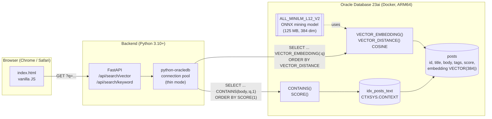
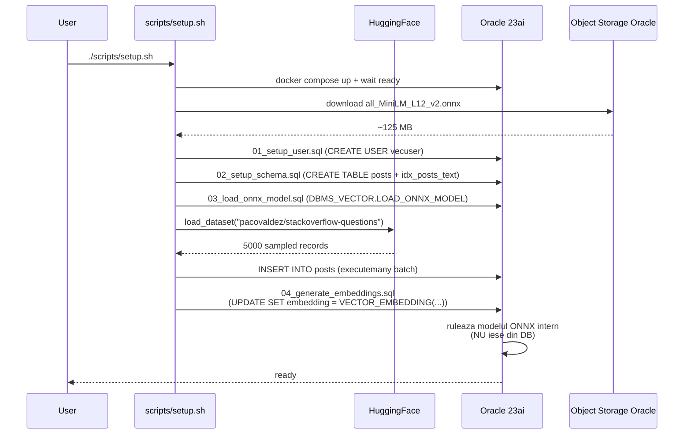
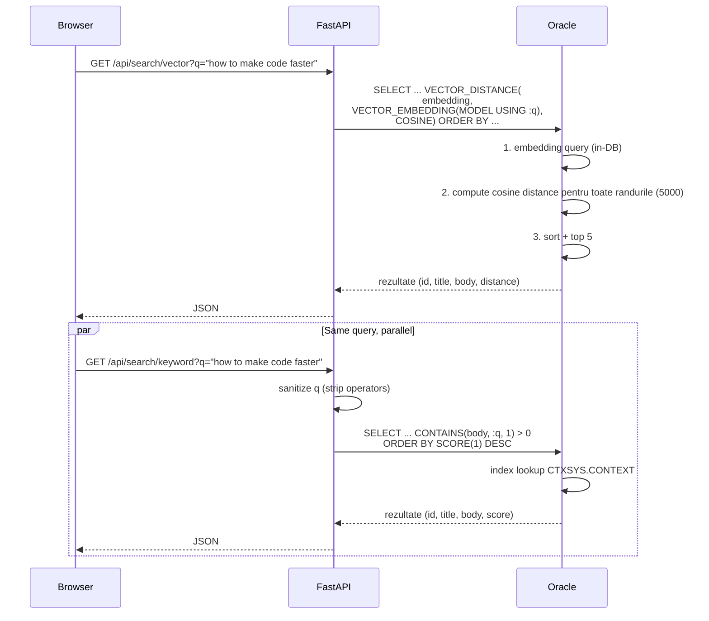

# Arhitectura solutiei

Acest document descrie arhitectura tehnica a demo-ului **Vector Search vs Keyword Search** pe Oracle Database 23ai.

## Diagrama componenta



## Flux de date la incarcare (one-time)



## Flux la runtime (per query)



## De ce aceasta arhitectura?

### Embedding-uri **in baza de date**, nu in Python

Modelul ONNX `all_MiniLM_L12_v2` este incarcat in Oracle 23ai prin
`DBMS_VECTOR.LOAD_ONNX_MODEL`. Toate operatiile de tip embedding (atat la
incarcare cat si la query) ruleaza prin SQL:

```sql
VECTOR_EMBEDDING(ALL_MINILM_L12_V2 USING 'text' AS data)
```

Avantaje:
- **Consistenta**: acelasi model pentru indexare si query (nu poate aparea
  drift intre versiunea Python si versiunea DB).
- **Performanta**: nu trebuie sa transferam vectori de 384 floats prin retea
  pentru fiecare query. Totul ramane local in DB.
- **Simplitate operationala**: backend-ul Python nu are dependinte
  ML (PyTorch / Transformers / ONNX runtime). Foarte usor de deployat.
- **Demonstrabil**: arata ca Oracle 23ai este o platforma AI integrata, nu
  doar un store de vectori.

### Cautare exacta vs index HNSW

Pentru **5000 randuri**, cautarea exacta (full scan + `ORDER BY VECTOR_DISTANCE`)
ruleaza in <100 ms. Avantaje:
- 100% recall (precizie).
- Zero edge cases legate de index (fara `vector_memory` overflow, fara
  rebuild costisitor).
- Mai rapid de demonstrat - presentation-friendly.

Pentru dataset-uri >100K randuri, ar fi necesar un index HNSW:
```sql
CREATE VECTOR INDEX idx_posts_emb ON posts(embedding)
  ORGANIZATION INMEMORY NEIGHBOR GRAPH
  DISTANCE COSINE
  WITH TARGET ACCURACY 95;
```

### Oracle Text ca baseline keyword

Multi consideram "keyword search" = `LIKE '%cuvant%'`. Acest demo foloseste
`CTXSYS.CONTEXT` - indexul invertit profesional al Oracle - cu:

- **Lexer** care normalizeaza case si stemming
- **SCORE(1)** care returneaza un scor TF-IDF-like
- Operatori avansati: `NEAR`, `ACCUM`, fuzzy match (nefolositi explicit aici,
  dar disponibili)

Acesta este o comparatie corecta academic: o solutie "traditional NLP" matura
contra unei solutii "neural embeddings".

## Caracteristici operationale

| Component | Specificatie |
|-----------|--------------|
| DB image | `container-registry.oracle.com/database/free:latest-lite` |
| Platforma | linux/arm64/v8 (native Apple Silicon) |
| `vector_memory_size` | 512 MB |
| Pool conexiuni | min=1, max=4 |
| Backend port | 8000 (FastAPI) |
| DB port | 1521 |
| Model ONNX | 125 MB (descarcat o singura data) |
| Dataset | ~5000 randuri din StackOverflow |
| Timp setup | ~10-15 minute |
| Timp embed bulk | ~2-5 minute pentru 5000 randuri |
| Latenta query vector | ~50-100 ms |
| Latenta query keyword | ~10-30 ms |
